# Hi there, I'm Navit! 👋

### 💻 Senior Software Engineer | Full-Stack Developer  
🌍 **Location:** Chandigarh, India

---

## 🛠 About Me
I’m a passionate Senior Software Engineer with a strong foundation in **JavaScript**, **TypeScript**, and modern web technologies. I focus on building **secure**, **scalable**, and **high-performance** applications — from backend APIs to frontend user experiences.

---

## 📊 GitHub Stats & Activity

---

## 🏆 Achievements & Medals

---

## 📅 Weekly GitHub Activity
*(Includes private commits)*  

---

## 🚀 Featured Projects

- **[User Onboarding ES6](https://github.com/ChoudharyNavit22/user_onboarding_es6)**  
  Node.js module for onboarding users with JWT-based authentication.

- **[Steam Game Library Analyser - Backend](https://github.com/ChoudharyNavit22/steam-game-library-analyser-backend)** (TypeScript)  
  Backend API for analysing Steam game libraries.

- **[Steam Game Library Analyser - Frontend](https://github.com/ChoudharyNavit22/steam-game-library-analyser-frontend)** (JavaScript)  
  Frontend UI for visualising and interacting with Steam game data.

- **[Chemist Warehouse Backend](https://github.com/ChoudharyNavit22/chemist-warehouse-backend)**  
  TypeScript backend service for warehouse operations.

---

## 🧰 Skills & Tech Stack

**Languages:**  
JavaScript, TypeScript, HTML, CSS, SQL, NoSQL, Python  

**Backend:**  
NestJs, Node.js, Express.js, MongoDB, PostgreSQL  

**Frontend:**  
React.js, Next.js, Redux  

**Testing:**  
Mocha, Chai  

**Other Tools:**  
Docker, Git, JWT, REST APIs, ORM's

---

## 📬 Let's Connect

  
  
  

